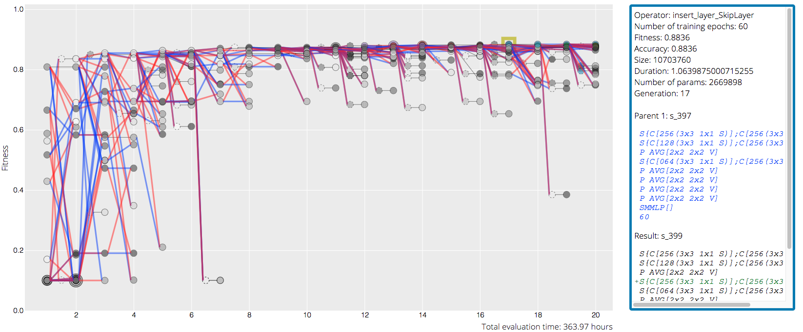

# Evolving Convolutional Neural Network Topologies for Image Recognition

Code base to my [MSc Thesis Artificial Intelligence](https://ga.yaron-strauch.com), University of Southampton.




## Academic Abstract

Convolutional Neural Networks (CNNs) are state-of-the-art algorithms for image recognition. To configure a CNN properly by hand, one requires deep domain knowledge, best practises, and trial and error. As deep learning progresses, manual configuration gets harder and automated ways such as genetic algorithms are required. We describe in-depth how CNN topologies can be evolved; to do so the "half pixel problem" that occurs during programmatic CNN creation and manipulation is established, analysed and solved. A new human-readable genome representation for topologies and a novel ancestry tree visualisation for genetic algorithms is used to deepen understanding of the algorithm. We rediscover common design patterns within the topologies found and see when and how the algorithm can recover from wrong assumptions in its initialisation logic. Regularisation and partial training is introduced, allowing speed-ups of up to 19% while maintaining result accuracy. [Read full thesis](https://ga.yaron-strauch.de)

## Technical Abstract
Generational Genetic Algorithm that finds topologies (number of layers, layer types, filters and kernel configurations, ...) for Convolutional Neural Networks in th econtext of image classification.

Individuals are initialised randomly using a search space that defines the domain of possible values. Using Machine Learning, individuals are trained on train and evaluated on test data. The accuracy (percentage of correctly classified images) is used as a fitness score for selection, and fitter individuals are selected for recombination with a higher probability. Selected individuals are recombined by slicing their genomic representation into two parts and crossing them over. The new generation is then trained again and the cycle continues until twenty epochs have passed. Different random initialisation approaches are implemented and compared (in the thesis), and different technologies for speeding up the algorithm are evaluated such as regularisation (decreasing fitness in relation to training time) and partial training (increasing the number of training epochs from generation to generation).

An interactive, zoomable graph helps visualising the GA and its genetic operators. It allows to view each individual's ancestry tree, genome, the specific mutation or cross-over, and stats.

## Disclaimer

This is an _academic_ project, i.e. hardly a tool that you can use for production. This is mainly due to the enormous time required to run it: Using 4 GTX 1080 in parallel on the CIFAR10 data set still requires over 3 days to complete.


## Technical Setup
### Install

We strongly advise installing [CUDA](https://developer.nvidia.com/cuda-downloads) first. The program will fall back to CPU if no CUDA compatible devices are found, however this will take significantly longer.

```bash
# using conda:
conda env create environment.yml
# or using pip without conda:
pip install -r requirements.txt
# or, if automatic installation doesn't work:
conda create -n cnn python=3 pandas==1.1.3 numpy==1.19.2 pylint==2.6.0 matplotlib==3.3.2 PyYAML==5.3.1 pytorch==1.7.0 torchvision==0.8.1 -c pytorch
```

### Run tests
```bash
python -m unittest discover tests/
```

### Run experiment
Run the corresponding python file from the root directory. The algorithm will automatically try to open and continue a pickle from the experiment folder, or create a new pickle. Because pickle files are bigger than 40GBs, they are not checked in.
```bash
python ga.cifar.approach3.py
```

### Run the ancestry visualisation
```bash
cd visualise
python visualise.py
```

Or, head to https://ga.yaron-strauch.com


## File Index
- cga_src.py: Implements all GA core functionality
    - base.py: All abstract and base classes
    - cnn.py: The CNN class, history, pickling
    - convolutional_layer.py
    - data.py: The data sets
    - evaluator.py: Objective fitness function
    - export.py: Diagram exporter for GA ancestry tree visualisation
    - ga.py: The genetic algorithm
    - hardware.py: Manages async GPUs
    - kernel.py: All kernel maths
    - pooling_layer.py
    - population.py: Caches individuals, fitnesses, implements selection
    - skip_layer.py: The skip layer
    - softmax_mlp.py
- experiments: The folder containing experiment pickles
- tests: Unit tests to ensure GA functionality
- visualise:
    - visualise.py: Creates the ancestry tree visualisation by parsing the pickles into yaml files
    - frontend: The interactive web interface
        - data: Holds parsed yaml files to be read by JavaScrupt
        - lib: Third party dependencies
        - available_data.js: Holds references to all yamls for frontend, generated automatically
        - main.js: Renders the yaml files interactively
    - graphs.py: All graphical analysis except for GA tree
    - lin_epoch.py: The visualisation of the linear epoch function
- cga.py: The main import for the GA framework
- ga.cifar.base.py: Experiment 1: Using the GA on CIFAR10
- ga.cifar.approach2.py and ga.cifar.approach3.py: Experiments 2+3: Different layer initialisations for deeper CNNs
- ga.mnist.py: Experiment 4: Using the GA on MNIST
- ga.cifar.regularisation.py: Experiment 5: Regularisation linear to evaluation time
- ga.cifar.linear.py: Experiment 6: Partial training of earlier generations
- pickling_ga.py: Helper script for starting experiments

## Yaml Experiment matching

The yaml files (for the interactive visualisation) are named more concisely in the archieve than in the thesis. This is the mapping from experiment number to file name:

1. data-CIFAR10__popsize-20__crossover-0.9__mutation-0.2__punishment-per-hour-0__learning-0.1_0.9_[1, 26, 43]_0.9__epochfn-const_epochs_60
2. approach-2__data-CIFAR10__popsize-20__crossover-0.9__mutation-0.2__punishment-per-hour-0__learning-0.1_0.9_[1, 26, 43]_0.9__epochfn-const_epochs_60
3. approach-3__data-CIFAR10__popsize-20__crossover-0.9__mutation-0.2__punishment-per-hour-0__learning-0.1_0.9_[1, 26, 43]_0.9__epochfn-const_epochs_60
4. data-MNIST__popsize-20__crossover-0.9__mutation-0.2__punishment-per-hour-0__learning-0.1_0.9_[1, 3, 5]_0.9__epochfn-const_epochs_6
5. data-CIFAR10__popsize-20__crossover-0.9__mutation-0.2__punishment-per-hour-0.05__learning-0.1_0.9_[1, 26, 43]_0.9__epochfn-const_epochs_60
data-CIFAR10__popsize-20__crossover-0.9__mutation-0.2__punishment-per-hour-0__learning-0.1_0.9_[1, 30, 50]_0.9__epochfn-linear_epochs_30_70
